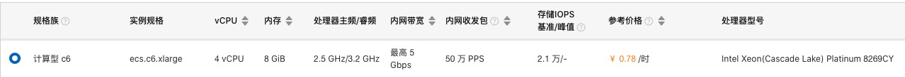

# programmer_1024_2021
# 2021年可兰达程序员节：数据挖宝

# 活动流程

1. 2021年10月8日：宣讲会。
2. 2021年10月9日下班前：完成组队，提交队伍成员和队名。
3. 2021年10月8日-10月22日下午3点前：开发调试阶段
4. 2021年10月22日下午3点-4点：提交程序到指定位置
5. 2021年10月22日下午5点：现场抽签决定分组，然后是比赛环节，比赛为淘汰赛，一局定胜负，胜出者进入下一次抽签分组直至决出前三名，每组最多3个退伍。
6. 2021年10月29日下午5点：颁奖以及前三名的分享会。

# 游戏规则

- 组委会提供1024个文件，每个数据文件包含100w条数据，每条数据用\n换行符分割

- 每一条的数据格式为json，形如：

  {"locationid":"2ixewekdyvgbfmfzli9iifm1w9hnd2ij5kr1avy1zw3c7rl","magic":"9248642713483188"}

- 如果locationid代表的字符，去掉字母部分，剩下的数据部分，通过加/减/乘/取余 1024，恰好等于 magic 字符串所代表的数字，那么这个地点就表示存在宝藏。

  例如 : {"locationid":"2mnab0kquw4uuu8nnm","magic":"2"} 抽取后的数字为2048，2048/1024 = 2 恰好等于magic代表的数字，所以这个地点就代表有宝藏.

- 找到宝藏地点后，需要把对应的locationid通过post请求，发送到我们的服务器，如果该宝藏还未被其他队伍找到，那么获得1分.

- 最后，得分最多的队伍获胜，如果有队伍得分一样，那么首先获得第1分的队伍获胜.

说明：1 - locationid的长度为固定的64个字符.

​		   2 - magic的长度为2-32个字符表示的数字.

​		   3 - magic "027" 表示 27.

# 奖项设置

第一名 ：奖金 4096 元

第二名 ：奖金 2048 元

第三名 ：奖金1024 元

# 参赛说明

1.参赛队伍请提供一个可在linux命令行下直接运行的可执行文件

2.数据目录和可执行文件在同一级目录

例如：

队伍 a 提交了他们的可执行文件 a.out

比赛时，会以 ./a.out 来运行，data目录在a.out的同级目录，运行参数可自行指定

./data/Treasure_0.data

./data/Treasure_1.data

./data/Treasure_2.data

...

./data/Treasure_1023.data

./a.out

# 机器及环境

机器配置 - 阿里云计算型c6



操作系统 - Ubuntu 18.04 64位

会准备一个调试环境给大家，详细硬件参数和规格可自行登陆查看

# Api

接口地址：http://47.104.220.230/dig

请求方法：POST

请求Header: application/json

请求参数:

```
{
	"locationid":"2ixewekdyvgbfmfzli9iifm1w9hnd2ij5kr1avy1zw3c7rl", //宝藏地点id
	"token":"ooaksuquwqiw=928182ijasj" //请求token
}
```

响应数据：

```
{
	"errorno":0, // 0表示dig成功，获得1分；1表示该id不是宝地点的id，不得分；2表示该id的宝藏已经被挖了，不得分;-1表示其他错误;
	"msg":"game has end." //当errno为-1时，会包含该字段
}
```


# post请求示例

curl示例:

```
curl -d '{"token":"test1","locationid":"moaooosas"}' http://47.104.220.230/dig
```

go语言:

```
		data := make(map[string]interface{})
		data["locationid"] = item.Locationid
		data["token"] = "test1"

		bytesData, _ := json.Marshal(data)
		resp, _ := http.Post("http://47.104.220.230/dig","application/json", bytes.NewReader(bytesData))
		defer resp.Body.Close()
		body, _ := ioutil.ReadAll(resp.Body)
		fmt.Println(string(body))
```

